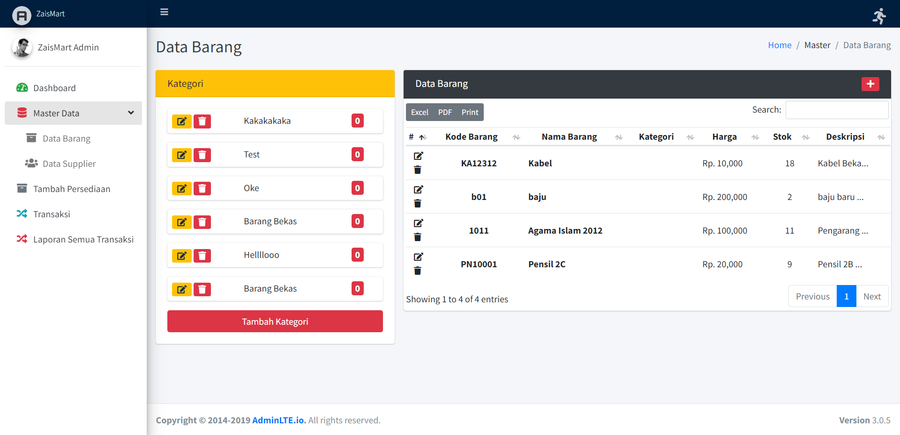
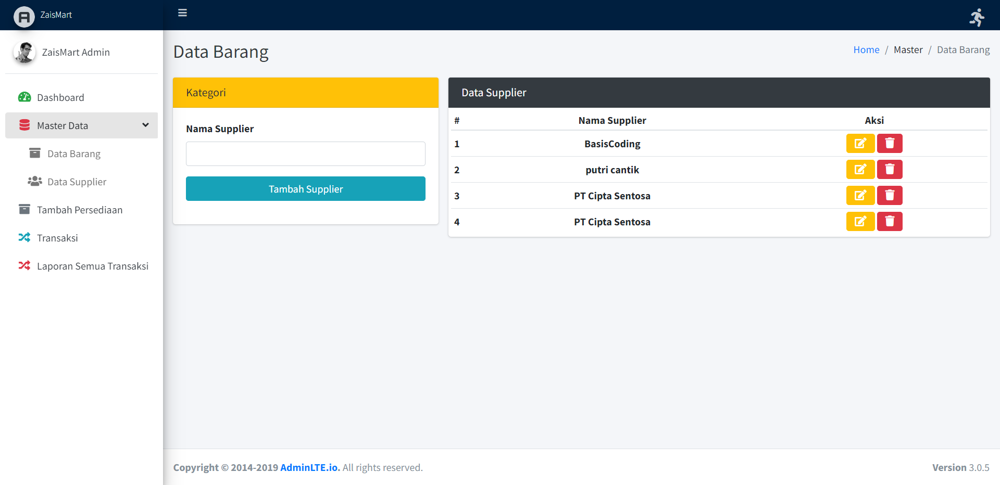
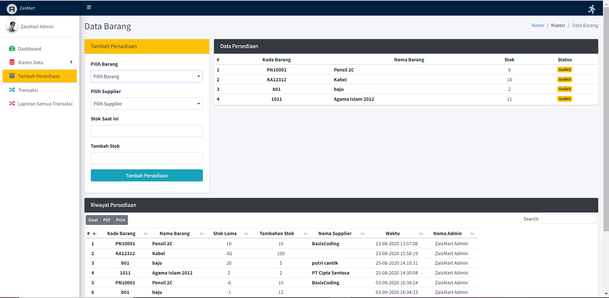
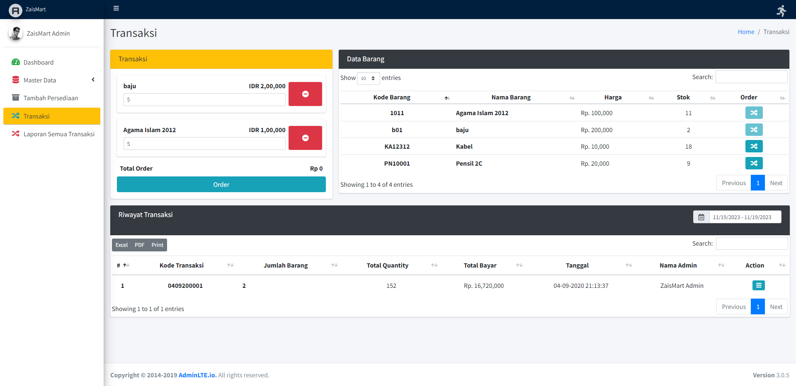
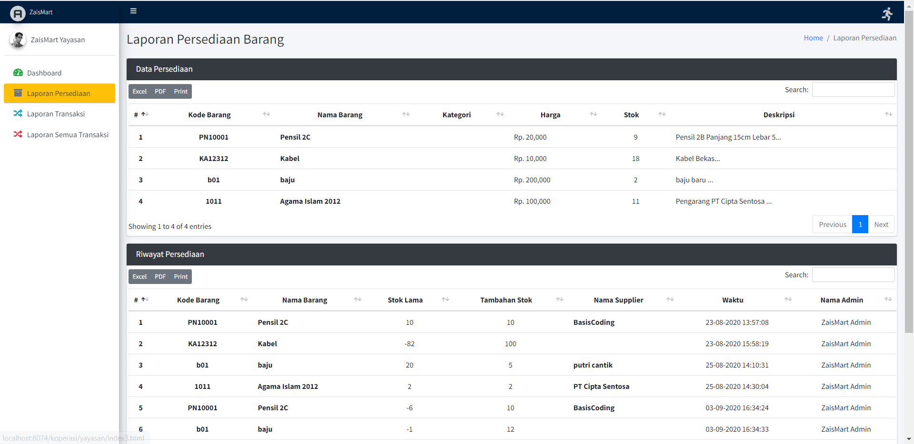
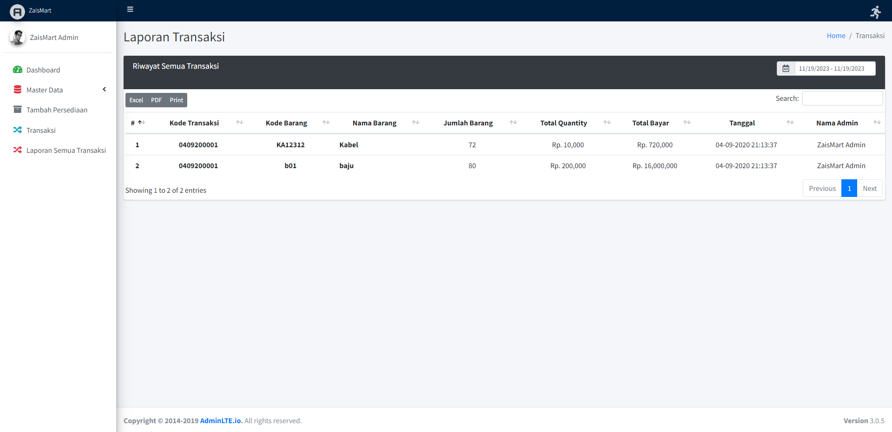

# Aplikasi Koperasi

Aplikasi ini dirancang untuk mengelola transaksi penjualan dan persediaan barang pada koperasi. Aplikasi Koperasi memiliki beberapa fitur utama untuk memudahkan manajemen persediaan dan transaksi.

## Fitur

1. **Master Data Barang**: Manajemen data barang yang tersedia di koperasi.
2. **Master Data Supplier**: Informasi dan manajemen data supplier/barang yang dipasok.
3. **Tambah Persediaan**: Penambahan barang ke dalam persediaan koperasi.
4. **Transaksi**: Pencatatan transaksi penjualan dan pembelian barang.
5. **Laporan Persediaan**: Laporan mengenai stok barang yang tersedia.
6. **Laporan**: Laporan transaksi penjualan dan pembelian.

## Screenshot

### 1. Master Data Barang

### 2. Master Data Supplier

### 3. Tambah Persediaan

### 4. Transaksi

### 5. Laporan Persediaan

### 6. Laporan

## Instalasi

1. Clone repositori ini: `git clone https://github.com/inotechno/koperasi.git`
2. Impor struktur database dari `koperasi.sql`.
3. Konfigurasi file `application/config/database.php` untuk pengaturan koneksi database.

## Role Akses

1. **Admin**: Akses penuh ke semua fitur aplikasi.
2. **Kepala Yayasan**: Akses terbatas sesuai dengan kebutuhan kepala yayasan.

## Kontribusi

Proyek ini terbuka untuk kontribusi. Jika Anda tertarik untuk berkontribusi atau melaporkan masalah, silakan buka issue atau pull request. Kami menyambut kontribusi Anda.

## Lisensi

Diberikan di bawah lisensi MIT - Lihat [LICENSE](LICENSE) untuk lebih lanjut.
